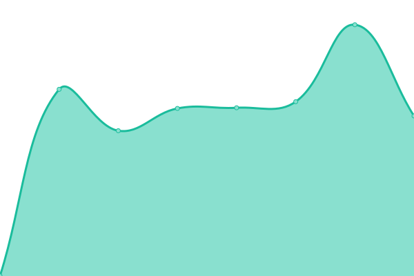
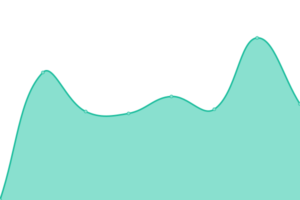

# [📈 Live Status](https://upptime.saboor.rocks): <!--live status--> **🟧 Partial outage**

This repository contains the open-source uptime monitor and status page for [Saboor Hakimi](https://aseelapp.com), powered by [Upptime](https://github.com/upptime/upptime).

With [Upptime](https://upptime.js.org), you can get your own unlimited and free uptime monitor and status page, powered entirely by a GitHub repository. We use [Issues](https://github.com/Saboor-Hakimi/upptime/issues) as incident reports, [Actions](https://github.com/Saboor-Hakimi/upptime/actions) as uptime monitors, and [Pages](https://upptime.saboor.rocks) for the status page.

<!--start: status pages-->
<!-- This summary is generated by Upptime (https://github.com/upptime/upptime) -->
<!-- Do not edit this manually, your changes will be overwritten -->
<!-- prettier-ignore -->
| URL | Status | History | Response Time | Uptime |
| --- | ------ | ------- | ------------- | ------ |
|  [ASEELAPP](https://aseelapp.com) | 🟩 Up | [aseelapp.yml](https://github.com/Saboor-Hakimi/upptime/commits/HEAD/history/aseelapp.yml) | 

 2347ms
     
 | 

<a href="https://upptime.sab00r.com/history/aseelapp">100.00%</a>
    

|  [Jobs.af](https://jobs.af) | 🟩 Up | [jobs-af.yml](https://github.com/Saboor-Hakimi/upptime/commits/HEAD/history/jobs-af.yml) | 

 2581ms
     
 | 

<a href="https://upptime.sab00r.com/history/jobs-af">99.79%</a>
    

|  [Login to HesabPay](https://api.hesab.af/) | 🟥 Down | [login-to-hesab-pay.yml](https://github.com/Saboor-Hakimi/upptime/commits/HEAD/history/login-to-hesab-pay.yml) | 

 0ms
     
 | 

<a href="https://upptime.sab00r.com/history/login-to-hesab-pay">100.00%</a>
    

|  [HEMIS](149.54.12.140) | 🟩 Up | [hemis.yml](https://github.com/Saboor-Hakimi/upptime/commits/HEAD/history/hemis.yml) | 

 215ms
     
 | 

<a href="https://upptime.sab00r.com/history/hemis">90.84%</a>
    

|  [Rahanet Movie AF](http://movie.af/) | 🟩 Up | [rahanet-movie-af.yml](https://github.com/Saboor-Hakimi/upptime/commits/HEAD/history/rahanet-movie-af.yml) | 

 1216ms
     
 | 

<a href="https://upptime.sab00r.com/history/rahanet-movie-af">99.32%</a>
    

<!--end: status pages-->

[**Visit our status website →**](https://upptime.saboor.rocks)

## 📄 License

- Powered by: [Upptime](https://github.com/upptime/upptime)
- Code: [MIT](./LICENSE) © [Saboor Hakimi](https://github.com/Saboor-Hakimi)
- Data in the `./history` directory: [Open Database License](https://opendatacommons.org/licenses/odbl/1-0/)
